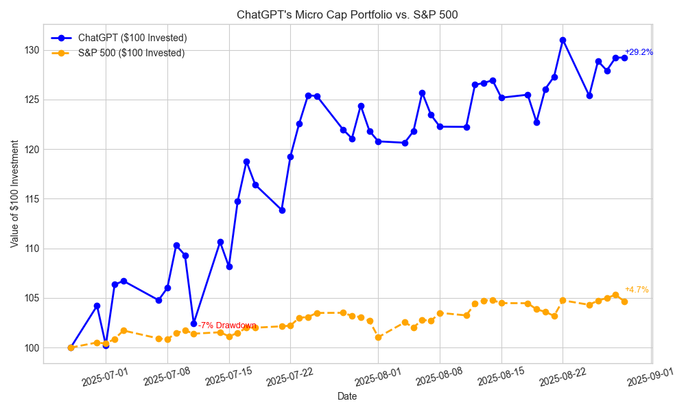

# ChatGPT Micro-Cap Experiment
Welcome to the repo behind my 6-month live trading experiment where ChatGPT manages a real-money micro-cap portfolio.

## Overview on getting started: [Here](https://github.com/LuckyOne7777/ChatGPT-Micro-Cap-Experiment/blob/main/Start%20Your%20Own/README.md)
   
## Repository Structure

- **`trading_script.py`** - Main trading engine with portfolio management and stop-loss automation
- **`Scripts and CSV Files/`** - My personal portfolio (updates every trading day)
- **`Start Your Own/`** - Template files and guide for starting your own experiment  
- **`Weekly Deep Research (MD|PDF)/`** - Research summaries and performance reports
- **`Experiment Details/`** - Documentation, methodology, prompts, and Q&A

# The Concept
Every day, I kept seeing the same ad about having some A.I. pick undervalued stocks. It was obvious it was trying to get me to subscribe to some garbage, so I just rolled my eyes.  
Then I started wondering, "How well would that actually work?"

So, starting with just $100, I wanted to answer a simple but powerful question:

**Can powerful large language models like ChatGPT actually generate alpha (or at least make smart trading decisions) using real-time data?**

## Each trading day:

- I provide it trading data on the stocks in its portfolio.  
- Strict stop-loss rules apply.  
- Every week I allow it to use deep research to reevaluate its account.  
- I track and publish performance data weekly on my blog: [Here](https://nathanbsmith729.substack.com)

## Research & Documentation

- [Research Index](https://github.com/LuckyOne7777/ChatGPT-Micro-Cap-Experiment/blob/main/Experiment%20Details/Deep%20Research%20Index.md)  
- [Disclaimer](https://github.com/LuckyOne7777/ChatGPT-Micro-Cap-Experiment/blob/main/Experiment%20Details/Disclaimer.md)  
- [Q&A](https://github.com/LuckyOne7777/ChatGPT-Micro-Cap-Experiment/blob/main/Experiment%20Details/Q%26A.md)  
- [Prompts](https://github.com/LuckyOne7777/ChatGPT-Micro-Cap-Experiment/blob/main/Experiment%20Details/Prompts.md)  
- [Starting Your Own](https://github.com/LuckyOne7777/ChatGPT-Micro-Cap-Experiment/blob/main/Start%20Your%20Own/README.md)  
- [Research Summaries (MD)](https://github.com/LuckyOne7777/ChatGPT-Micro-Cap-Experiment/tree/main/Weekly%20Deep%20Research%20(MD))  
- [Full Deep Research Reports (PDF)](https://github.com/LuckyOne7777/ChatGPT-Micro-Cap-Experiment/tree/main/Weekly%20Deep%20Research%20(PDF))
- [Chats](https://github.com/LuckyOne7777/ChatGPT-Micro-Cap-Experiment/blob/main/Experiment%20Details/Chats.md)
# Current Performance

<!-- To update performance chart: 
     1. Replace the image file with updated results
     2. Update the dates and description below
     3. Update the "Last Updated" date -->

**Last Updated:** August 29th, 2025

**Current Status:** Portfolio is outperforming the S&P 500 benchmark

*Performance data is updated after each trading day. See the CSV files in `Scripts and CSV Files/` for detailed daily tracking.*

# Features of This Repo
- Live trading scripts — used to evaluate prices and update holdings daily  
- LLM-powered decision engine — ChatGPT picks the trades  
- Performance tracking — CSVs with daily PnL, total equity, and trade history  
- Visualization tools — Matplotlib graphs comparing ChatGPT vs. Index  
- Logs & trade data — auto-saved logs for transparency  

# Why This Matters
AI is being hyped across every industry, but can it really manage money without guidance?

This project is an attempt to find out — with transparency, data, and a real budget.

# Tech Stack & Features

## Core Technologies
- **Python** - Core scripting and automation
- **pandas + yFinance** - Market data fetching and analysis
- **Matplotlib** - Performance visualization and charting
- **ChatGPT-4** - AI-powered trading decision engine

## Key Features
- **Robust Data Sources** - Yahoo Finance primary, Stooq fallback for reliability
- **Automated Stop-Loss** - Automatic position management with configurable stop-losses
- **Interactive Trading** - Market-on-Open (MOO) and limit order support
- **Backtesting Support** - ASOF_DATE override for historical analysis
- **Performance Analytics** - CAPM analysis, Sharpe/Sortino ratios, drawdown metrics
- **Trade Logging** - Complete transparency with detailed execution logs

## System Requirements
- Python  3.11+
- Internet connection for market data
- ~10MB storage for CSV data files

# Follow Along
The experiment runs from June 2025 to December 2025.  
Every trading day I will update the portfolio CSV file.  
If you feel inspired to do something similar, feel free to use this as a blueprint.

Updates are posted weekly on my blog, more coming soon!

Blog: [A.I Controls Stock Account](https://nathanbsmith729.substack.com)

Have feature requests or any advice?  

Please reach out here: **nathanbsmith.business@gmail.com**
